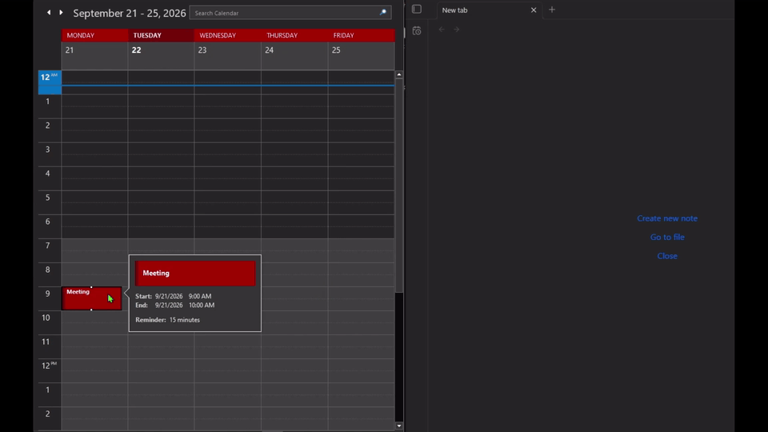
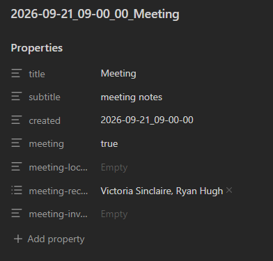

# Outlook Event Notes

[](https://buymeacoffee.com/nathanstorm)

An [Obsidian](https://obsidian.md) plugin that creates notes from Microsoft Outlook meetings, appointments, and recurring events by dragging and dropping Outlook `.msg` files or exported `.ics` files onto a ribbon icon.





> **Based on [Outlook Meeting Notes](https://github.com/davidingerslev/outlook-meeting-notes) by [David Ingerslev](https://github.com/davidingerslev).**
> This fork adds support for recurring events, opening existing notes, and other improvements.

---

## Features

- **Drag & drop** a meeting or appointment from Outlook Classic onto the ribbon icon → a note is instantly created (or opened if it already exists)
- **Recurring events** — uses the occurrence date supplied by Outlook when available, or asks you to confirm a suggested date
- **Fully customisable** filename pattern and note template using [Mustache](https://mustache.github.io/mustache.5.html) syntax
- **No Microsoft 365 / Graph API dependency** — processes `.msg` and `.ics` files locally
- **Safe note properties** — quotes and escapes imported text so punctuation and multiline invitations remain valid YAML

## Installation

### Community Plugins
Search for **Outlook Event Notes** in Obsidian → Settings → Community Plugins.

### Manual installation
1. Download `main.js`, `manifest.json`, and `styles.css` from the [latest release](https://github.com/nathanstorm689/outlook-event-notes/releases/latest)
2. Copy them into your vault at `.obsidian/plugins/outlook-event-notes/`
3. Enable the plugin in Obsidian → Settings → Community Plugins

---

## Usage

Drag and drop a meeting or appointment from the **Outlook Classic** desktop calendar onto the plugin ribbon icon. The plugin will:

1. Parse the `.msg` file
2. For recurring events, use the supplied occurrence date or ask you to confirm the nearest calculated occurrence
3. Create a new note — or open the existing one if a note for that event already exists

You can also save a calendar appointment or meeting as a `.msg` or `.ics` file and drop it onto the icon. A `.msg` email or invitation message is not a calendar appointment; open the event in your calendar before saving it. Import one file containing one event at a time.

### Recurring events
For recurring `.msg` files, the plugin first looks for the occurrence date in the file and the drag text. If neither provides a usable date, a dialog suggests the nearest valid occurrence from the recurrence pattern. Confirm or correct that date, or cancel to stop importing.

A recurring `.ics` series without an explicit occurrence asks you to enter the date. Unsupported recurrence patterns, including Hijri patterns, can also require manual date selection. Always use the date shown in your calendar.

---

## Settings

The settings page includes the installed version, author, compatibility details, documentation and support links, and a **Buy me a coffee** button. Your existing settings are kept when you update.

### Folder location
The folder where new notes are created. Created automatically if it does not exist (supports subfolders like `Meetings/2026`).

### Filename pattern
Uses Mustache syntax. Default:
```
{{#helper_dateFormat}}{{apptStartWhole}}|YYYY-MM-DD_HH-mm-ss{{/helper_dateFormat}} {{subject}}
```
Produces filenames like `2026-07-30_18-20-05 Réunion d'équipe`.

Use **Folder location** to choose subfolders. Slashes in the filename pattern are treated as invalid filename characters.

### Invalid character substitute
Characters that are invalid in filenames (`/ * " \ < > : | ?`) are replaced with this value. Blank = remove them.

### Template
Fully customisable Mustache template. All `.msg` [fields](https://hiraokahypertools.github.io/msgreader/typedoc/interfaces/MsgReader.FieldsData.html) are available, plus the helper fields and functions below.

Imported values in YAML properties are quoted and escaped automatically, preserving punctuation, leading blank lines, and multiline invitation text. Existing notes are opened without being rewritten; this update does not repair older notes automatically.

#### Default template
```
---
title: {{subject}}
subtitle: meeting notes
created: {{#helper_dateFormat}}{{apptStartWhole}}|YYYY-MM-DD_HH-mm-ss{{/helper_dateFormat}}
meeting: 'true'
meeting-location: {{apptLocation}}
meeting-recipients:
{{#recipients}}
  - {{name}}
{{/recipients}}
meeting-invite: {{body}}
---
```

---

## Template helpers

### Helper fields

| Field | Description |
|---|---|
| `{{helper_currentDT}}` | Date/time the file was dropped, in ISO format (e.g. `2026-03-11T19:00:00-05:00`) |

Use `helper_dateFormat` to reformat it:
```
{{#helper_dateFormat}}{{helper_currentDT}}|YYYY-MM-DD_HH-mm-ss{{/helper_dateFormat}}
```

### Helper functions

#### `helper_dateFormat`
Formats a date using [moment.js](https://momentjs.com/). Separate the field and format with `|`.

```
{{#helper_dateFormat}}{{apptStartWhole}}|YYYY-MM-DD_HH-mm-ss{{/helper_dateFormat}}
```
produces `2026-03-11_19-00-00`

```
{{#helper_dateFormat}}{{apptStartWhole}}|L LT{{/helper_dateFormat}}
```
Uses Obsidian's display language locale (e.g. `11/03/2026 19:00` in English GB, `03/11/2026 7:00 PM` in English US).

#### `helper_firstWord`
Returns only the first word of a field — useful for recording first names only:
```
meeting-recipients:
{{#recipients}}
  - {{#helper_firstWord}}{{name}}{{/helper_firstWord}}
{{/recipients}}
```

---

## Credits

- Original plugin: [Outlook Meeting Notes](https://github.com/davidingerslev/outlook-meeting-notes) by [David Ingerslev](https://github.com/davidingerslev)
- [msgreader](https://github.com/HiraokaHyperTools/msgreader) — `.msg` file parsing
- [mustache.js](https://github.com/janl/mustache.js) — template rendering
- [mustache-validator](https://github.com/eliasm307/mustache-validator) — template validation
- [ical.js](https://github.com/kewisch/ical.js) — iCalendar parsing
- [windows-iana](https://github.com/rubenillodo/windows-iana) — Windows time-zone name mapping

See [THIRD_PARTY_NOTICES.txt](THIRD_PARTY_NOTICES.txt) for additional library notices.

---

## License

0BSD — see [LICENSE](LICENSE).
